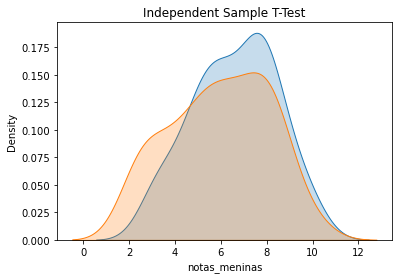

# Independent T-test

Goal: compare the mean in two different and populations 


## Example: School test

We want to see if the performance on a test has any gender bias.

H1:    μ score_girls  ≠ μ score_boys<br>
H0:    μ score_girls  = μ score_boys


```python
from scipy import stats
import seaborn as sns
import matplotlib.pyplot as plt
import pandas as pd
```


```python
# Importing datasets:

score_boys = pd.read_csv("score_boys.csv", decimal=",")
score_girls = pd.read_csv("score_girls.csv", decimal=",")

score_boys.head()
```


<div>
<style scoped>
    .dataframe tbody tr th:only-of-type {
        vertical-align: middle;
    }

    .dataframe tbody tr th {
        vertical-align: top;
    }

    .dataframe thead th {
        text-align: right;
    }
</style>
<table border="1" class="dataframe">
  <thead>
    <tr style="text-align: right;">
      <th></th>
      <th>notas_meninos</th>
      <th>boy_id</th>
    </tr>
  </thead>
  <tbody>
    <tr>
      <th>0</th>
      <td>8.2</td>
      <td>id1</td>
    </tr>
    <tr>
      <th>1</th>
      <td>7.0</td>
      <td>id2</td>
    </tr>
    <tr>
      <th>2</th>
      <td>4.3</td>
      <td>id3</td>
    </tr>
    <tr>
      <th>3</th>
      <td>6.4</td>
      <td>id4</td>
    </tr>
    <tr>
      <th>4</th>
      <td>5.6</td>
      <td>id5</td>
    </tr>
  </tbody>
</table>
</div>


```python
score_girls.head()
```


<div>
<style scoped>
    .dataframe tbody tr th:only-of-type {
        vertical-align: middle;
    }

    .dataframe tbody tr th {
        vertical-align: top;
    }

    .dataframe thead th {
        text-align: right;
    }
</style>
<table border="1" class="dataframe">
  <thead>
    <tr style="text-align: right;">
      <th></th>
      <th>notas_meninas</th>
      <th>girl_id</th>
    </tr>
  </thead>
  <tbody>
    <tr>
      <th>0</th>
      <td>8.5</td>
      <td>id1</td>
    </tr>
    <tr>
      <th>1</th>
      <td>7.8</td>
      <td>id2</td>
    </tr>
    <tr>
      <th>2</th>
      <td>6.0</td>
      <td>id3</td>
    </tr>
    <tr>
      <th>3</th>
      <td>8.0</td>
      <td>id4</td>
    </tr>
    <tr>
      <th>4</th>
      <td>7.4</td>
      <td>id5</td>
    </tr>
  </tbody>
</table>
</div>


```python
print(score_boys.describe(), "\n\n", score_girls.describe())
```

           notas_meninos
    count      66.000000
    mean        5.939394
    std         2.147620
    min         2.300000
    25%         4.325000
    50%         6.000000
    75%         7.800000
    max        10.000000 
    
            notas_meninas
    count      57.000000
    mean        6.585965
    std         1.831221
    min         3.000000
    25%         5.400000
    50%         6.400000
    75%         8.000000
    max        10.000000


We see that the girl's score mean is 0.6 points higher than the boy's score mean. Is that statistically significant?


```python
#Let's first do a plot:

sns.kdeplot(score_girls.notas_meninas, shade=True)
sns.kdeplot(score_boys.notas_meninos, shade=True)

plt.title("Independent Sample T-Test")
```


    Text(0.5, 1.0, 'Independent Sample T-Test')


    

    


The two samples look really close to each other, so I wouldn't be so sure


```python
#Independent sample T-Test
tStat, pValue = stats.ttest_ind(score_girls.notas_meninas, score_boys.notas_meninos, equal_var = False)

print("P-Value:{0} T-Statistic:{1}".format(pValue,tStat)) #print the P-Value and the T-Statistic
```

    P-Value:0.07400351808744167 T-Statistic:1.8022016716240892


Our p-value is higher than 0.05, therefore we do not reject the null hypothesis, meaning that there is no gender bias in the score.
